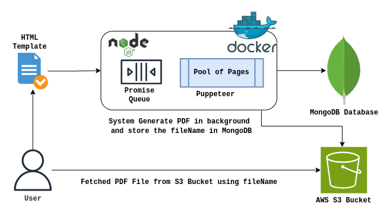

# Notice-PDF-Generation-System

## Overview
The Notice PDF Generation System is designed to efficiently convert HTML templates into PDFs, store them in AWS S3, and provide secure download links using pre-signed URLs. It is built with a focus on scalability, performance, and resource efficiency.

## Architecture Diagram


## Documentation
- The Design Documentation is added in the github named ***Notice-PDF-Generation-System-Doc.pdf***

## Tech Stack
- **Node.js** with **TypeScript**
- **MongoDB** for data storage
- **AWS S3** for PDF storage
- **Puppeteer** for HTML-to-PDF conversion
- **PQueue** for task management
- **Docker** for containerization

## Setup Instructions

### Prerequisites
- **Node.js** (v16+ recommended)
- **Docker** (for containerized deployment) : Provide proper URL
- **MongoDB** (local or cloud instance)
- **AWS S3** (for storage) : **AWS Access Key & Secret Key with S3 Bucket Name is required as the PDF file is getting stored in the bucket. Also make sure that the S3 bucket is publicly accessible**
- Use the below bucket policy to make the S3 bucket publicly accessible

```bash
{
    "Version": "2012-10-17",
    "Statement": [
        {
            "Sid": "BlockPublicAccess",
            "Effect": "Deny",
            "Principal": "*",
            "Action": "s3:GetObject",
            "Resource": "arn:aws:s3:::<bucket_name>/*",
            "Condition": {
                "Bool": {
                    "aws:SecureTransport": "false"
                }
            }
        }
    ]
}
```

### Installation
```sh
# Clone the repository
git clone <repo-url>
cd notice-pdf-generator

# Install dependencies
npm install

# Change the pm2.config.cjs file and configure environment variables

# Start locally
pm2-runtime pm2.config.cjs

# Start under docker
# Make Sure make command is installed. else you can use the command directly from the Makefile to build and run the instance
make rebuild
```

## Environment Variables
Changes to be done in pm2.config.cjs file
| Variable | Description |
|----------|-------------|
| `AWS_S3_BUCKET` | Name of the S3 bucket |
| `AWS_ACCESS_KEY_ID` | AWS Access Key |
| `AWS_SECRET_ACCESS_KEY` | AWS Secret Key |
| `AWS_REGION` | AWS region |
| `MONGO_URI` | MongoDB connection string |

## Usage

### Steps to Generate PDF
1. Generate the template using the *POST /api/v1/templates*
2. Get the template_id and create notice using *POST /api/v1/notices*
3. Based on the notice_id generate pdf using *POST /api/v1/generate-pdf/notice_id*
4. Get the presigned URL using the fileName got in the ***generate-pdf*** API using *POST /api/v1/download/fileName*
5. Access the pdf using the presigned URL

### NOTE: The postman collection is added to implement the same

## Performance Benchmarking
- Handles **500-600 PDFs per minute**.
- Optimized Puppeteer page pooling for memory efficiency.
- Uses **PQueue** to control concurrent PDF generation tasks.
